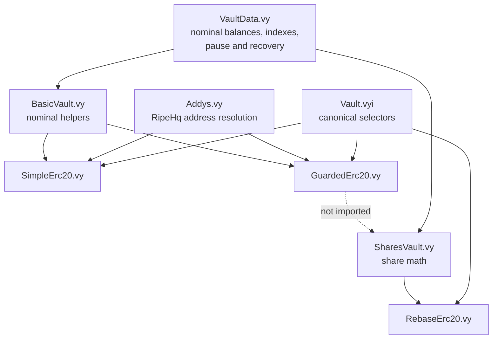

# GuardedErc20: custody and delivery containment

> **Superseded 4 August 2026.** This explainer is retained only as historical
> evidence for the removed artifact. The current candidate puts the narrowed
> fail-closed behavior in `BasicVault` and uses it through `SimpleErc20`; it
> intentionally omits the redundant post-deposit checks and hard-coded
> Endaoment recipient prohibition described below. See
> [`basic-vault-fail-closed.md`](basic-vault-fail-closed.md).

> [!IMPORTANT]
> **Draft explanatory synthesis.** This document is owner education and
> independent technical analysis. It is not controlling approval, deployment,
> activation, migration, or release evidence. “Recommended” means an agent
> recommendation unless an owner-approved direction or repository gate is
> identified explicitly.

## Current `rh` rebind

The current authority for this page is `rh` commit
`0642f086d19e3cc62faaf67da096b6511e405320`, tree
`d869d4149380b368f9678ed03efc0b59a6c804e2`. The dated 28 July snapshot and
results below remain historical evidence.

| Current identity | Value |
| --- | --- |
| GuardedErc20 source Git blob / SHA-256 | `713dab98bb9a08585e0c1f937425e8142cd600ab` / `0fcdb02a0b3adf56ef0fd04397c57ac40325a37c87a32f29979dadc5eaf353ed` |
| Runtime template | 10,524 bytes; SHA-256 `e3dae3cc8bc64712d9d95adb24674f3c363e0df43d8eb853c6b430907d544a14`; 14,052 bytes EIP-170 headroom |
| [`test_guarded_erc20.py`](../../../../tests/vaults/test_guarded_erc20.py) | Git blob `700d6c3857795cc2058d54668252b53168fdb738`; SHA-256 `45fb971f92987017fed5ea40e85f74a3f3bb41bfe3f0a2f367f57f76c5b248f9` |
| [Consumer inventory test](../../../../tests/vaults/test_guarded_consumer_inventory.py) | Git blob `f845bb4e317cb4031b0f67cb14f5504d9d3a3c70`; SHA-256 `b975206683403daf27ae40d25a34d56d802fccc731512227888e55bd99697817` |
| [Stock comparison test](../../../../tests/vaults/test_stock_token_vault_comparison.py) | Git blob `b8c33f0df312d1ed1e04343337685c4f8c88a377`; SHA-256 `288f8d3fb5cc5de902e4d3918f1ab0c1b7946af243148af34dc6f084e681191c` |
| [AuctionHouse Stock-delivery test](../../../../tests/core/auctionHouse/test_auctionhouse_stock_delivery.py) | Git blob `f19d5dcb1fcf7a6a37132ee1a0b0e02b3b70c3e7`; SHA-256 `2a0be15fe4241562bee5b3157a1f98d17ba9306c7403314c2a7e514df96a9546` |
| [Deleverage Stock-delivery test](../../../../tests/core/deleverage/test_deleverage_stock_delivery.py) | Git blob `d8a0d95317b45ac7a20016945a05f14ae3eead6d`; SHA-256 `c74b1b0d8b22e5a064109c6f811b98010d40aa979600683d57d3d67e5a385d54` |

Later integrated safety tests now cover named source mutants, deficits and
surpluses, bounded withdrawals, cross-user/cross-vault isolation, malformed and
oversized returns, atomic retry, and inherited surplus recovery. Later
AuctionHouse and Deleverage tests cover composed Stock delivery. These close
the prior mutation/recovery/composition gaps; they do not by themselves prove a
final asset binding or activation. Current repository launch authority
separately selects AAPL as the sole initial Stock symbol and GuardedErc20 as its
exclusive vault capability, while the token/feed verification, price and cap
freeze, exact risk and auction tuple, fresh VaultBook slot, deployed address,
and atomic M5 activation binding remain unresolved. No behavioral suite was
rerun for this documentation-only refresh.

The integrated Deleverage source and composition tests were inspected for the
current package without reopening further Deleverage work. CCIP work is
owner-parked and outside scope. Zero-backing
settlement, loss allocation, and bad-debt policy are also owner-parked: the code
behavior remains relevant, but those subjects are not current work items or
current Wave 1 blockers. Parking does not decide their eventual release
disposition.

## Authority labels used here

| Label | Meaning |
| --- | --- |
| **Integrated fact** | Established by source or tests present in the reviewed repository snapshot |
| **Historical evidence** | A result from an earlier candidate, implementation, or integration record; not silently restated as current |
| **Independently reproduced** | Re-executed during the independent review at the identified snapshot |
| **Agent recommendation — not owner-approved** | Review advice only; not authorization, a release gate, or an owner decision |
| **Owner-approved direction** | A controlling product/architecture direction stated in the owner records or this harmonization instruction |
| **Owner-parked work** | Not a current work item or Wave 1 blocker; eventual disposition remains undecided |
| **Deployment or release gate** | Evidence or binding still required before the relevant deployment/activation claim can be made |

## Reviewed implementation snapshot

| Field | Reviewed value and status |
| --- | --- |
| Review date | 28 July 2026 |
| Production source | [`contracts/vaults/GuardedErc20.vy`](../../../../contracts/vaults/GuardedErc20.vy) |
| Implementation commit | `4f887207d344a1513d6c3a79d315c8315a10a9c8` |
| Implementation parent | `e39815d710ecfaf8bbeea54cabe8ae8d553a2740` |
| Reviewed `rh` commit | `cca60bb85c772c977bb9fb62c1c6c5252c3a1438` |
| Reviewed `rh` tree | `161fb828f3bbf4cb12596a5dfaf6c9bf1e153381` |
| Source SHA-256 | `0fcdb02a0b3adf56ef0fd04397c57ac40325a37c87a32f29979dadc5eaf353ed` |
| Integration status | **Integrated fact:** the implementation commit is an ancestor of the reviewed `rh`; the Guarded source, ABI, and focused test bytes match the implementation snapshot |
| Deployment/activation status | **Not established by this document:** source integration is not a VaultBook slot, deployed address, asset binding, migration, or activation |
| Later evidence status | Dated snapshot only; current M4 and later safety tests are described in the current rebind above |

The implementation commit is a **reviewed implementation snapshot**, not a
permanent synonym for “current `rh`.” Future readers must rebind the baseline
before describing later repository state.

## Direct answers for the owner

1. **Why did we create a new contract instead of editing an existing vault?**
   The checks could have been implemented in `SimpleErc20` or `BasicVault`; a
   new contract was not an EVM necessity. A separate artifact makes “nominal
   claims with fail-closed backing” an explicit deployment capability without
   silently changing future Simple deployments or adopting share-vault loss and
   surplus economics.
2. **Is GuardedErc20 fundamentally a hardened Simple/Basic vault?** Yes. It
   reuses `Addys`, `VaultData`, `BasicVault`, and the canonical `Vault`
   interface. It stores nominal units and has no `SharesVault` dependency.
3. **Is any material part based on RebaseErc20/SharesVault?** No. Rebase is a
   comparison model only. Guarded adds no shares, conversion math, pro-rata
   repricing, or donation allocation.
4. **Did it add persistent storage or change the canonical vault selectors?**
   No guarded-specific persistent field was added. Its 34 function signatures
   match SimpleErc20. The three wrapper event names differ, so their topic hashes
   differ.
5. **What happens after backing loss?** Stored nominal claims remain, but unsafe
   backing is reported as zero through the two credit-facing amount getters and
   deposit, withdrawal, and internal movement revert. Guarded freezes; it does
   not allocate the loss.
6. **Does editing repository source update Base?** No. Deployed immutable Base
   bytecode does not change when source changes. Giving a funded Base asset the
   guarded runtime would require a new deployment and a separately approved
   custody/position migration.
7. **What is the intended Robinhood role?** The guarded capability is intended
   for admitted Stock assets while Simple remains the ordinary non-Stock
   nominal vault. Current `rh` integrates the AAPL launch-input authority and
   selects GuardedErc20 for the sole initial Stock symbol. It still leaves the
   external token/feed facts, exact risk/cap/auction values, fresh VaultBook
   slot, deployed address, and atomic activation packet unresolved; no live
   configuration or activation follows from source or selection alone.

## Executive verdict

| Question | Conclusion and authority |
| --- | --- |
| Is the integrated source technically justified? | **Yes — agent conclusion supported by integrated facts.** It enforces aggregate solvency, exact delivery, strict returndata, and backing-aware valuation without changing shared nominal or share semantics. |
| Was a separate contract strictly necessary? | **No.** It was the most operationally prudent and least disruptive feasible boundary. |
| Is a GuardedErc20 source correction currently recommended? | **No — agent recommendation, not owner approval.** No reviewed finding requires a production-source edit. |
| Are more tests useful? | The former mutation and inherited-recovery gaps are closed by later integrated tests. Exact-token qualification and change-triggered artifact checks remain release controls, not evidence of a current runtime defect. |
| What remains before deployment or activation? | **Deployment/release gates:** exact artifact and VaultBook binding, exact-token compatibility, composed route/configuration evidence, and the applicable owner-approved operational package. |
| What is parked? | **Owner-parked:** zero-backing settlement, loss allocation, bad-debt policy, CCIP, and further Deleverage work. None is converted here into current implementation scope or a current Wave 1 blocker. |

## Behavior before the change and concrete failure mode

`SimpleErc20` delegates nominal accounting to
[`BasicVault`](../../../../contracts/vaults/modules/BasicVault.vy).
BasicVault credits
[`min(request, current custody)`](../../../../contracts/vaults/modules/BasicVault.vy#L23-L39),
withdraws after capping by current custody, and makes a typed transfer
([`BasicVault.vy:42-65`](../../../../contracts/vaults/modules/BasicVault.vy#L42-L65)).
Its internal movement changes nominal balances without observing custody
([`BasicVault.vy:68-87`](../../../../contracts/vaults/modules/BasicVault.vy#L68-L87)).

That is coherent when custody changes only through the vault. An
issuer-controlled token can violate the assumption through burn, seizure,
force transfer, redemption, pause/blocklist behavior, or implementation change.
After custody falls:

- user and total nominal balances can remain positive;
- credit consumers can continue seeing phantom value;
- early withdrawals can consume remaining custody before later users;
- internal auction movement can transfer a nominal claim with no deliverable
  collateral; and
- debt/accounting transitions can be attempted against an undeliverable asset.

The selected containment model defines:

```text
C = exact observed token balance held by the vault
N = total nominal liability

usable backing = observation succeeded and C >= N
deficit        = observation succeeded and C < N
unknown        = observation failed or returned non-32-byte data
```

| State | Credit-facing amount | Deposit | Withdrawal | Internal movement |
| --- | ---: | --- | --- | --- |
| `C == N` | Nominal | Exact only | Exact delivery only | Exact and custody-neutral |
| `C > N` | Nominal; surplus uncredited | Exact only | Preserves surplus | Does not allocate surplus |
| `C < N` | Zero | Reverts | Reverts | Reverts |
| Unknown | Zero | Reverts | Reverts | Reverts |

A one-unit deficit freezes the asset for every user. That liveness cost is
intentional containment, not a hidden pro-rata allocation.

## Architecture and composition



Guarded's declarations at
[`GuardedErc20.vy:6-18`](../../../../contracts/vaults/GuardedErc20.vy#L6-L18)
match Simple's `Vault`, `Addys`, `VaultData`, and `BasicVault` composition
([`SimpleErc20.vy:6-18`](../../../../contracts/vaults/SimpleErc20.vy#L6-L18)).
Rebase instead initializes SharesVault
([`RebaseErc20.vy:6-18`](../../../../contracts/vaults/RebaseErc20.vy#L6-L18)).

Guarded reuses constructor wiring, nominal storage/index bookkeeping, pause and
recovery exports, deposit metadata, Lootbox nominal share, position discovery,
and total nominal liability. It wraps BasicVault for deposit and internal
movement, but bypasses BasicVault withdrawal so it can own strict transfer and
recipient-delivery checks.

## Exact source delta and execution flow

### Core entry points

| Guarded function | Source and closest predecessor | Exact behavioral delta |
| --- | --- | --- |
| `__init__` | [`Guarded 39-43`](../../../../contracts/vaults/GuardedErc20.vy#L39-L43); [`Simple 40-44`](../../../../contracts/vaults/SimpleErc20.vy#L40-L44) | Same `Addys`, unpaused `VaultData`, and `BasicVault` initialization; no mode field or new stored policy. |
| `depositTokensInVault` | [`Guarded 51-79`](../../../../contracts/vaults/GuardedErc20.vy#L51-L79); [`Simple 52-64`](../../../../contracts/vaults/SimpleErc20.vy#L52-L64); [`Basic 23-39`](../../../../contracts/vaults/modules/BasicVault.vy#L23-L39) | Require known custody and `C >= N + request`; call Basic; require exact credit, unchanged custody during accounting, and exact total-liability increase. |
| `withdrawTokensFromVault` | [`Guarded 82-137`](../../../../contracts/vaults/GuardedErc20.vy#L82-L137); [`Simple 67-82`](../../../../contracts/vaults/SimpleErc20.vy#L67-L82); [`Basic 42-65`](../../../../contracts/vaults/modules/BasicVault.vy#L42-L65) | Require known pre-solvency; reject current nonzero Endaoment endpoints; reduce nominal directly; strict raw transfer; prove exact vault outflow, recipient delivery, and post-solvency. |
| `transferBalanceWithinVault` | [`Guarded 140-182`](../../../../contracts/vaults/GuardedErc20.vy#L140-L182); [`Simple 85-100`](../../../../contracts/vaults/SimpleErc20.vy#L85-L100); [`Basic 68-87`](../../../../contracts/vaults/modules/BasicVault.vy#L68-L87) | Require known solvency; prove exact seller/buyer deltas, unchanged total liability, unchanged custody, and post-solvency. |

### Views and helpers

| Function | Source | Guarded behavior |
| --- | --- | --- |
| `getVaultDataOnDeposit` | [`190-194`](../../../../contracts/vaults/GuardedErc20.vy#L190-L194) | Reuses nominal Basic metadata; not a credit valuation getter. |
| `getUserLootBoxShare` | [`197-201`](../../../../contracts/vaults/GuardedErc20.vy#L197-L201) | Reuses nominal share; reward enablement remains configuration. |
| `getUserAssetAndAmountAtIndex` | [`204-218`](../../../../contracts/vaults/GuardedErc20.vy#L204-L218) | Empty remains `(zero, 0)`; a nonempty unsafe position becomes `(asset, 0)`; safe position returns nominal. |
| `getUserAssetAtIndexAndHasBalance` | [`221-225`](../../../../contracts/vaults/GuardedErc20.vy#L221-L225) | Reuses nominal position existence so unsafe backing does not erase identity. |
| `getTotalAmountForUser` | [`233-239`](../../../../contracts/vaults/GuardedErc20.vy#L233-L239) | Returns zero for unknown/deficient backing, otherwise nominal. |
| `getTotalAmountForVault` | [`242-245`](../../../../contracts/vaults/GuardedErc20.vy#L242-L245) | Returns nominal liability, not custody. |
| `_hasUsableBacking` | [`248-254`](../../../../contracts/vaults/GuardedErc20.vy#L248-L254) | True only for an exact successful observation with `C >= N`. |
| `_transferOut` | [`257-275`](../../../../contracts/vaults/GuardedErc20.vy#L257-L275) | Accepts empty returndata or exact 32-byte canonical `true`; rejects failure, false, malformed, short, and oversized data. |
| `_observeExactBalance` | [`278-292`](../../../../contracts/vaults/GuardedErc20.vy#L278-L292) | Static raw call; failed or non-32-byte data becomes `(False, 0)` rather than bubbling through backing-aware views. |

### Complete operation flow

```text
deposit
  -> Teller-only
  -> observe exact vault custody C0
  -> require known and C0 >= N + Q
  -> BasicVault nominal credit
  -> require credited amount == Q
  -> observe C1; require known and C1 == C0
  -> require total nominal == N + Q
  -> event and Q

withdrawal
  -> Teller/AuctionHouse/CreditEngine only
  -> observe vault C0; require known and C0 >= N
  -> reject current nonzero Endaoment Funds/PSM recipients
  -> observe recipient R0
  -> validate pause/addresses/Q
  -> reduce nominal; cap request to available nominal/custody
  -> strict raw transfer
  -> observe vault C1 and recipient R1
  -> require C0 - C1 == paid == R1 - R0
  -> require C1 >= remaining nominal
  -> event and result

internal movement
  -> AuctionHouse/CreditEngine only
  -> observe C0; require known and C0 >= N
  -> snapshot seller and buyer
  -> BasicVault nominal movement
  -> prove exact seller decrease and buyer increase
  -> require total nominal unchanged
  -> observe C1; require C1 == C0 and C1 >= N
  -> event and result
```

Deposit is exact only. Withdrawal and internal movement retain the prior
partial/full/over-request convention: an over-request is capped to available
nominal balance and full depletion returns `isDepleted=True`. A zero result
rejects. A later-row transaction failure rolls back every earlier batch effect.

### Why raw calls are necessary

| Property | Balance observation | Outbound transfer |
| --- | --- | --- |
| Target | Asset contract | Asset contract |
| Selector | `balanceOf(address)` / `0x70a08231` | `transfer(address,uint256)` / `0xa9059cbb` |
| Call mode | `STATICCALL`, zero value | Ordinary `CALL`, zero value |
| Gas | No explicit cap; default available gas | No explicit cap; default available gas |
| Output ceiling | 33 bytes | 33 bytes |
| Accepted | Exactly 32 bytes decoded as `uint256` | Empty, or exactly 32-byte canonical `true` |
| Rejected/classified | Failure, empty, 1-31, or 33+ bytes become unknown | Failure, false, malformed Boolean, 1-31, or 33+ bytes revert |

Typed Vyper calls did not expose the raw length policy needed here. In
particular, the rejected candidate's typed transfer accepted a valid 32-byte
Boolean plus a trailing byte. A 33-byte capture ceiling distinguishes exact data
from every oversized result; a 32-byte ceiling would truncate and hide the
extra byte.

This policy supports standard true-return and legacy no-return transfers.
Fee-on-transfer, recipient burn/tax, reflection, rebasing during the call, and
other nonexact delivery are intentionally incompatible.

## Accounting-model comparison

| Question | Simple / Basic | Rebase / Shares | Guarded |
| --- | --- | --- | --- |
| Stored user value | Nominal token units | Shares | Nominal token units |
| Partial loss | Claims do not reprice; transaction order determines realized loss | Share value falls pro rata | Claims do not reprice; all guarded mutations freeze |
| Total loss | Nominal balances remain; internal movement can continue | Live amount becomes zero; historical shares remain | Nominal balances remain; credit-facing amounts zero and mutations freeze |
| Donation/positive rebase | Surplus uncredited | Accrues to shareholders through share value | Surplus observed but unallocated |
| Deposit during deficit | Can credit against custody without aggregate-solvency proof | Mints shares from current totals | Reverts |
| Withdrawal during deficit | Can pay early caller until custody is exhausted | Pays live pro-rata amount when nonzero | Reverts |
| Unsafe getters | Nominal amounts remain visible | Live amounts track custody | Two credit-facing getters return zero; position/bookkeeping getters stay nominal |
| Restoration | Original nominal claims remain | Existing share value rises | Original nominal claims mechanically become usable once `C >= N` |
| Loss policy | No explicit allocation | Pro-rata share allocation | Containment/freeze only |

**Owner-parked work:** who ultimately receives surplus, who absorbs loss, and
what happens when backing cannot be restored are not decided by GuardedErc20 and
are not current Wave 1 work.

## Why the selected design was used

| Alternative | Source/deployment effect | Assessment |
| --- | --- | --- |
| Modify `BasicVault` | Recompiles every future nominal wrapper; existing immutable deployments remain unchanged | Too broad; silently changes the shared nominal primitive and expands audit scope |
| Replace `SimpleErc20` behavior under the same name | Narrower source change, compatible selectors/layout possible | Technically feasible but creates same-name semantic/runtime divergence for future deployments |
| Add a mode flag | Adds state/default/authority/transition risk; existing deployments cannot acquire it by source edit | Converts artifact selection into continuing configuration risk |
| Use/extend SharesVault | Changes stored meaning, rounding, donation, partial-loss, and post-zero economics | Reject for this minimum policy because it chooses loss/surplus allocation |
| Extract a shared guarded module | Adds a new dependency and recompiles every consumer | Defer until a second genuinely identical guarded consumer exists |
| Separate Guarded wrapper | One explicit artifact; canonical selectors and nominal layout; distinct events/runtime | Selected: technically coherent, operationally prudent, and least disruptive |

A fresh Robinhood vault starts empty, so the selected new artifact needs no
initial balance migration. A funded Simple vault would still require an
explicit custody, user-position, debt, auction, and configuration migration to
adopt Guarded behavior.

## Intended deployment and asset assignment

| Asset class | Reviewed direction/status |
| --- | --- |
| Initial Stock candidate | Current repository launch authority selects AAPL and the exact Guarded artifact, but token/feed verification, exact risk/cap/auction values, fresh slot/ID, deployed identity, atomic configuration, and activation remain separate unresolved gates |
| Later Stock assets | No automatic assignment; token-specific review required |
| Ordinary non-Stock nominal assets / approved LP routes | SimpleErc20 remains the documented ordinary nominal role |
| Rebase/share assets | Rebase semantic slot is reserved but omitted from the initial Robinhood plan |
| GREEN Stability Pool / RIPE governance | Dedicated vault roles; not GuardedErc20 |
| Existing Base nominal assets | Existing deployed bytecode remains unchanged; no migration is authorized here |
| Future chains | No automatic inheritance; explicit artifact and asset decision required |

Primary configuration evidence:

- ordinary Simple and omitted Rebase roles:
  [`robinhood-blueprint-phase-a.md:1543-1548`](../evidence/robinhood-blueprint-phase-a.md#L1543-L1548);
- AAPL-only initial Stock and route boundaries:
  [`robinhood-blueprint-phase-a.md:2733-2743`](../evidence/robinhood-blueprint-phase-a.md#L2733-L2743); and
- no guessed Guarded VaultBook ID:
  [`robinhood-blueprint-phase-a.md:2553-2562`](../evidence/robinhood-blueprint-phase-a.md#L2553-L2562).

## Test-to-invariant matrix

The focused file is
[`tests/vaults/test_guarded_erc20.py`](../../../../tests/vaults/test_guarded_erc20.py).

| Test | Invariant, adversary, and rollback evidence |
| --- | --- |
| [`test_exact_deposit_preserves_units_layout_and_event`, 516-538](../../../../tests/vaults/test_guarded_erc20.py#L516-L538) | Real Teller deposit produces exact user/total delta and event; Teller supplies call-local receipt proof. |
| [`test_preexisting_surplus_remains_uncredited_and_live`, 541-559](../../../../tests/vaults/test_guarded_erc20.py#L541-L559) | Donation stays surplus; user receives only the request. |
| [`test_deficit_blocks_deposit_without_allocating_new_nominal`, 562-585](../../../../tests/vaults/test_guarded_erc20.py#L562-L585) | Issuer burn creates deficit; deposit reverts with token and nominal state unchanged. |
| [`test_unknown_backing_blocks_mutation_and_zeroes_usable_views`, 593-637](../../../../tests/vaults/test_guarded_erc20.py#L593-L637) | Revert/empty/1/31/33/64-byte `balanceOf` blocks mutations and zeroes usable views without erasing position identity. |
| [`test_deficit_zeroes_usable_views_but_surplus_preserves_only_nominal`, 640-663](../../../../tests/vaults/test_guarded_erc20.py#L640-L663) | Deficit, restoration, exact backing, and surplus follow the selected view semantics. |
| [`test_true_empty_and_zero_nominal_index_returns_empty_zero`, 691-714](../../../../tests/vaults/test_guarded_erc20.py#L691-L714) | True empty `(zero, 0)` remains distinct from nonempty unsafe `(asset, 0)`. |
| [`test_internal_movement_is_exact_partial_or_full_and_custody_neutral`, 725-757](../../../../tests/vaults/test_guarded_erc20.py#L725-L757) | Partial/full/over-request amounts preserve exact seller/buyer deltas, custody, and total liability. |
| [`test_internal_movement_ignores_token_transfer_controls`, 760-782](../../../../tests/vaults/test_guarded_erc20.py#L760-L782) | Documents intentional custody-neutral behavior: pause/blocklist transfer controls are not consulted because no token transfer occurs. |
| [`test_internal_failure_on_deficit_or_self_transfer_is_atomic`, 785-828](../../../../tests/vaults/test_guarded_erc20.py#L785-L828) | Deficit or self-transfer reverts every nominal/index/custody effect. |
| [`test_internal_unknown_post_read_reverts_all_nominal_changes`, 831-866](../../../../tests/vaults/test_guarded_erc20.py#L831-L866) | Malformed/reverting post-read rolls back earlier nominal movement. |
| [`test_external_partial_and_full_withdrawals_match_outflow_delivery_and_report`, 869-901](../../../../tests/vaults/test_guarded_erc20.py#L869-L901) | Partial/full/over-request withdrawal matches nominal reduction, vault outflow, recipient delivery, and depletion flag. |
| [`test_external_withdrawal_preserves_surplus_without_assigning_it`, 904-924](../../../../tests/vaults/test_guarded_erc20.py#L904-L924) | Donation remains after nominal withdrawal. |
| [`test_compatible_transfer_returndata_succeeds`, 1172-1195](../../../../tests/vaults/test_guarded_erc20.py#L1172-L1195) | Empty and exact true-return transfers remain live. |
| [`test_rejected_transfer_returndata_rolls_back_every_observable_effect`, 1209-1232](../../../../tests/vaults/test_guarded_erc20.py#L1209-L1232) | Revert/false/short/33/64/malformed Boolean rejects and rolls back nominal, token, index, and log effects. |
| [`test_nonexact_external_delivery_reverts_all_vault_and_token_state`, 1248-1271](../../../../tests/vaults/test_guarded_erc20.py#L1248-L1271) | Fee/burn/reflection-style delta mismatch reverts all token and vault state. |
| [`test_post_transfer_unknown_balance_reverts_atomically`, 1276-1299](../../../../tests/vaults/test_guarded_erc20.py#L1276-L1299) | Successful transfer followed by unknown post-read rolls back transfer and nominal reduction. |
| [`test_shared_mutex_rejects_authorized_callback_and_rolls_back_outer_withdrawal`, 1302-1356](../../../../tests/vaults/test_guarded_erc20.py#L1302-L1356) | Actually authorized nested caller reaches the shared mutex; outer withdrawal and token effects roll back. |
| [`test_real_teller_batch_routes_partial_exact_and_over_request_through_guarded`, 1690-1801](../../../../tests/vaults/test_guarded_erc20.py#L1690-L1801) | Real Teller batch preserves amount/depletion behavior. |
| [`test_real_teller_batch_later_guarded_failure_rolls_back_every_earlier_row`, 1804-1925](../../../../tests/vaults/test_guarded_erc20.py#L1804-L1925) | Later failure restores every earlier nominal/token/purchaser/event effect in the transaction. |
| [`test_current_endaoment_endpoints_are_rejected_before_delivery`, 1933-1989](../../../../tests/vaults/test_guarded_erc20.py#L1933-L1989) | Current nonzero Endaoment Funds/PSM recipients reject before delivery. |
| [`test_roles_pause_and_normal_recipient_behavior_remain_live`, 1992-2051](../../../../tests/vaults/test_guarded_erc20.py#L1992-L2051) | Unauthorized/paused paths reject while authorized ordinary recipients remain live. |

The real batch tests use Teller's fungible-auction batch path with an
AuctionHouse-compatible endpoint. The current package also inspects the later
integrated AuctionHouse and Deleverage Stock-delivery composition tests.

### Current mutation sensitivity and residual limits

| Evidence | Classification |
| --- | --- |
| Authorized nested mutex test | Strong: authorization no longer short-circuits the callback; historical disposable removal of all three `@nonreentrant` decorators made the scenario fail |
| Oversized transfer tests | Strong: 33- and 64-byte returndata directly exercise the corrected raw-length boundary |
| Later-row batch rollback | Strong: proves real transaction-level rollback, not scalar behavior only |
| Source/ABI/layout assertions | Static or compiler evidence; protects reviewed identity but is not a behavioral mutation |
| Guard-by-guard deletion | Closed for the named G1 invariants: checked-in mutants cover request bounds, mutex, exact return length, recipient delta, vault outflow, post-solvency, internal custody neutrality, and backing-aware views |
| Post-read malformed matrix | Representative malformed and oversized cases are integrated; every byte length is not repeated at every post-read site |
| Dishonest exact balance | Trust boundary: an exact but false `balanceOf` cannot be detected |
| Recovery exports | Closed for registered/nonzero-liability rejection, unregistered zero-liability recovery, return variants, recipient mismatch boundary, and `recoverFundsMany` rollback |
| Gas grief | Residual availability risk: no explicit token-call gas cap |

### Initial candidate findings and final correction

| Historical finding | Final integrated correction |
| --- | --- |
| Typed transfer accepted exact true plus trailing byte | `_transferOut` uses a 33-byte ceiling and accepts only empty or exact 32-byte true |
| Reentrancy test failed at authorization before the mutex | Final callback actor is actually authorized and reaches the shared mutex |
| No batch/multi-row rollback proof | Real Teller batch and later-row atomic rollback tests were added |
| Stale collection/inventory reconciliation | Feature commit added the production record, checker logic, and tests; later integrated reseal `6e8844a` reconciled combined inventory authority |

## ABI, storage, constructor, runtime, gas, and migration effects

| Surface | Reviewed result |
| --- | --- |
| Compiler | Vyper `0.4.3+commit.bff19ea2` |
| ABI | 40 entries: 34 functions, five events, one constructor |
| Function selectors | Same signature set as SimpleErc20 |
| Events | Three Guarded-specific wrapper names/topics; `VaultPauseModified` and `VaultFundsRecovered` unchanged |
| Constructor | Same single `_ripeHq` input and module initialization as Simple |
| Persistent storage | No Guarded-specific field; same exported Addys/VaultData layout |
| Reentrancy state | Vyper shared transient nonreentrant key; no new persistent slot |
| Runtime | Guarded 10,524 bytes; Simple 8,753; Rebase 10,359 |
| Creation bytecode | Guarded 10,691 bytes; Simple 8,920; Rebase 10,526 |
| Gas evidence | No empirical transaction-gas benchmark was independently rerun; static complexity is two balance reads for deposit/internal movement, four for withdrawal, and one for each backing-aware view |
| Migration | Fresh empty deployment needs no position migration; adopting Guarded for a funded vault requires explicit state/custody/configuration migration |
| Existing deployments | Repository source edits do not change deployed immutable Base bytecode |

“ABI compatible” means canonical callable signatures remain compatible. It does
not mean observational identity: events, runtime bytes, revert order/reasons,
token compatibility, view values under deficit, and gas differ.

## Residual risks and trust assumptions

1. **Truthful token accounting.** Exact response shape and deltas cannot detect
   a token that lies consistently.
2. **Teller composition.** Guarded observes custody after Teller transfers.
   Aggregate `C >= N + Q` does not prove call-local receipt when prior surplus
   exists; Teller's exact `C1 - C0 == Q` measurement is still required.
3. **Fail-closed availability.** Reverting, malformed, or expensive token reads
   can deny deposit, withdrawal, internal movement, and backing-aware views.
4. **Strict compatibility.** Fee, reflection, recipient-tax, and nonexact
   delivery assets are intentionally unsupported.
5. **Aggregate freeze.** Any deficit freezes every user's operations for that
   asset; no proportional escape exists.
6. **Getter discipline.** Only `getUserAssetAndAmountAtIndex` and
   `getTotalAmountForUser` are backing-aware. Bookkeeping/position consumers
   must not substitute nominal getters for value.
7. **Mechanical restoration.** Once exact observed custody again covers nominal
   liability, operations resume automatically. That mechanic is not approval
   of a recapitalization or an allocation decision.
8. **Internal movement boundary.** Transfer pause/blocklist controls are not
   consulted because no ERC-20 transfer occurs; custody neutrality and solvency
   are the enforced properties.
9. **Inherited recovery.** `VaultData.recoverFunds` is limited to unregistered,
   zero-liability assets but does not use Guarded's strict recipient-delta
   wrapper.
10. **Containment only.** Guarded can freeze deficient settlement; it does not
    define loss, auction completion, debt forgiveness, or bad-debt accounting.

## Next actions

### Currently required

These are existing deployment/release boundaries, not newly authorized
implementation:

1. Bind and review the exact Guarded artifact, constructor input, VaultBook
   slot/ID, asset identity, and configuration before claiming deployment or
   activation.
2. Qualify the exact production token's raw `balanceOf` and `transfer`
   returndata, exact custody/recipient deltas, issuer controls, pause/blocklist,
   burn/force-transfer/redemption behavior, upgrade model, and repeated-read
   liveness.
3. Prove the enabled deposit route composes Teller's call-local exact receipt
   with Guarded's aggregate-backing checks.
4. Revalidate the relevant Teller, AuctionHouse, CreditEngine, and Guarded
   routes against the exact deployment artifacts and configuration.
5. Preserve the capability boundary: describe the integrated AAPL launch-input
   selection as repository configuration, not a completed asset/slot/deployment
   binding, and infer no automatic later-Stock or future-chain adoption.

This class does **not** authorize further Deleverage work, CCIP operations,
settlement, loss allocation, bad debt, deployment, configuration, or Stock
activation. Current M4 composition evidence and the AAPL launch-input selection
are integrated facts, not lifecycle authorization.

### Recommended hardening

**Agent recommendations — not owner-approved and not current source defects:**

1. Retain the integrated named-mutant and inherited
   `recoverFunds`/`recoverFundsMany` regressions.
2. Automate locked-compiler ABI regeneration, selector/event comparison,
   persistent-layout comparison, runtime-size checks, the focused Guarded
   suite, Guarded inventory selection, and the inventory checker when relevant
   files change.
3. Retain consumer-path tests proving collateral-value and borrowing paths use
   a backing-aware amount while position discovery may remain nominal.
4. Add monitoring and an incident runbook for unknown observations,
   `custody < nominal`, unexpected surplus, issuer/admin changes, and repeated
   guarded reverts.
5. Label SimpleErc20 in asset-admission material as an ordinary nominal vault
   that is unsuitable by default when custody can change outside the vault.

### Parked by owner

The following are accurate technical topics but are not current work items,
current Wave 1 blockers, or source-change authorization:

- zero-backing settlement and auction completion while Guarded remains
  deficient;
- user/protocol/issuer loss allocation;
- surplus ownership and recapitalization allocation;
- bad-debt recognition, debt forgiveness, and exactly-once accounting;
- policy for permanent versus temporary backing loss;
- automatic Base migration;
- CCIP workflows; and
- further Deleverage work beyond the integrated source and composition evidence.

Parking does not approve, reject, or set the release disposition of those
subjects.

### Explicitly not recommended

**Agent recommendation — not owner approval:**

- do not change GuardedErc20 source at the reviewed snapshot;
- do not modify BasicVault globally;
- do not replace SimpleErc20 under the same name with guarded semantics;
- do not add a mutable guarded-mode flag;
- do not use SharesVault unless the owner affirmatively selects share-based
  loss and surplus economics;
- do not weaken exact returndata or exact-delivery checks to admit an
  incompatible token;
- do not add a token-call gas cap without exact-token evidence and an explicit
  liveness analysis;
- do not refactor into a shared module solely to remove duplication; and
- do not describe Guarded containment as settlement or bad-debt resolution.

Revisit a shared guarded module only after a second real consumer demonstrates
the same invariants. Revisit Base migration only after a separate asset/control
and live-exposure review.

## Compatibility appendix

### Nominal storage and exported administration

Guarded and Simple both initialize `VaultData(False)` and export its management
surface. The shared nominal state includes:

- user balances by user and asset;
- aggregate nominal balances by asset;
- per-user asset arrays and reverse indexes;
- registered vault-asset arrays and reverse indexes; and
- pause and recovery administration.

The balance mutation primitives remain
[`VaultData._addBalanceOnDeposit`](../../../../contracts/vaults/modules/VaultData.vy#L52-L75)
and
[`VaultData._reduceBalanceOnWithdrawal`](../../../../contracts/vaults/modules/VaultData.vy#L77-L95).
Guarded does not introduce a second balance mapping or shadow liability total.
That is why its stored units and migration shape remain nominal rather than
share-based.

The exported recovery path remains
[`VaultData.recoverFunds`](../../../../contracts/vaults/modules/VaultData.vy#L277-L302).
It is restricted to an unregistered asset with zero recorded liability and is
not a deficit settlement mechanism. It also retains typed token calls rather
than Guarded's exact recipient-delta wrapper. The current G2 recovery tests pin
that compatibility boundary, including accepted/rejected return shapes,
recipient mismatch, and batch rollback.

### Function and event compatibility

| Surface | SimpleErc20 | GuardedErc20 | Compatibility consequence |
| --- | --- | --- | --- |
| Canonical Vault functions | 34 function signatures | Same 34 signatures | Generic consumers can use the same interface/selectors |
| Constructor | `_ripeHq` | `_ripeHq` | Deployment encoding remains one address |
| Deposit event | `SimpleErc20VaultDeposit` | `GuardedErc20VaultDeposit` | Same fields/indexing; different topic hash |
| Withdrawal event | `SimpleErc20VaultWithdrawal` | `GuardedErc20VaultWithdrawal` | Same fields/indexing; different topic hash |
| Internal-transfer event | `SimpleErc20VaultTransfer` | `GuardedErc20VaultTransfer` | Same fields/indexing; different topic hash |
| Pause/recovery events | Inherited | Inherited | Event signatures remain the same |
| Revert surface | Basic validation and typed calls | Pre/post backing, exact delivery, raw length, and endpoint checks | Consumers must accept additional fail-closed reverts |
| Value under deficit | Nominal | Zero through two amount getters | Credit behavior changes without erasing position identity |

Event declarations are at
[`GuardedErc20.vy:20-37`](../../../../contracts/vaults/GuardedErc20.vy#L20-L37)
and
[`SimpleErc20.vy:21-38`](../../../../contracts/vaults/SimpleErc20.vy#L21-L38).
Indexers must select the correct wrapper topics rather than assuming Simple
event identities.

### Token-behavior compatibility

| Token behavior | Deposit composition | Guarded withdrawal | Classification |
| --- | --- | --- | --- |
| Canonical exact transfer, exact 32-byte balance | Teller and Guarded proofs pass | Exact true-return transfer passes | Supported |
| Legacy no-return transfer | Teller retains its prior transfer compatibility if exact receipt holds | Empty transfer returndata accepted if exact deltas hold | Supported |
| Transfer returns exact false | Teller transfer rejects | Raw transfer rejects | Unsupported/fail-closed |
| Transfer reverts | Reverts | Reverts | Unsupported/fail-closed |
| Short or oversized `balanceOf` | Teller/Guarded exact observation rejects or becomes unknown | Pre/post observation rejects | Unsupported/fail-closed |
| Exact true plus trailing bytes | Not an accepted exact response policy | Raw transfer rejects at 33-byte sentinel | Unsupported/fail-closed |
| Fee, recipient burn/tax, or short delivery | Teller exact receipt rejects deposit | Exact recipient delta rejects withdrawal | Intentionally unsupported |
| Reflection/excess receipt | Teller rejects when net receipt differs from request | Exact outflow/delivery rejects nonexact movement | Intentionally unsupported |
| Rebase during observation window | Only passes if every exact net invariant happens to hold | Only passes if exact outflow, delivery, and solvency hold | Not generally supported |
| Exact but dishonest balance report | Can fabricate the observed invariant | Can fabricate custody/delivery observations | Residual token-trust boundary |

Asset admission should test the exact artifact and configuration rather than
infer compatibility from an ERC-20 label.

### Source, bytecode, deployment, and migration are different actions

| Action | What changes | What does not change |
| --- | --- | --- |
| Edit repository `BasicVault` or `SimpleErc20` source | Future compilation inputs and review identity | Already deployed immutable contracts |
| Compile a future artifact | Creation/runtime bytecode and generated ABI evidence | Any live deployment until a transaction uses the artifact |
| Deploy Guarded but do not register it | A new empty contract exists | Existing vault routes, custody, users, and configuration |
| Register/enable Guarded for a fresh asset | Future calls route to the selected artifact | No historical position migration if the asset truly starts empty |
| Move a funded Simple asset to Guarded | Requires custody, nominal balances, indexes, debt, auctions, configuration, and rollback reconciliation | Cannot be achieved by editing source or changing a name |

Operational rollback is correspondingly staged:

1. **Before deployment:** omit the artifact from the release.
2. **After deployment but before registration/funding:** leave it unregistered
   or replace the planned binding.
3. **After registration but before positions:** disable the route through the
   applicable governed process.
4. **After custody or positions exist:** rollback is a stateful migration, not a
   source revert.

## Historical versus current validation evidence

| Evidence | Classification and result |
| --- | --- |
| First candidate | **Historical evidence:** 45 focused cases passed, but review still rejected the package for oversized returndata, authorization-tautological reentrancy, missing batch rollback, and stale collection/inventory reconciliation |
| Final implementation package | **Historical evidence:** corrected source/test/inventory package introduced 55 collected Guarded cases |
| Reviewed `rh` Guarded suite | **Independently reproduced:** `tests/vaults/test_guarded_erc20.py` — 55 passed |
| Guarded inventory selection | **Independently reproduced:** 8 passed, 87 deselected |
| Full integrated inventory module | **Reviewed-snapshot count:** 95 collected tests at `cca60bb…`; this harmonization did not rerun or relabel the full module |
| Reviewed-snapshot inventory checker | **Independently reproduced at the dated review:** `CLOCK_INVENTORY_OK`; 99 production occurrences, 94 production lines, 17 files, 95 classified Vyper paths, 59 post-S5 production records |
| Current inventory checker | **Fresh current check:** `CLOCK_INVENTORY_OK`; 102 production occurrences, 97 production lines, 18 files, 96 classified Vyper paths, 60 post-S5 production records |
| Full repository suite | Not rerun for this review; no current full-suite claim is made |

The production record at
[`config/block-clock-inventory.json:16260`](../../../../config/block-clock-inventory.json#L16260)
pins the Guarded path and source hash. The checker identifies Guarded at
[`check_block_clock_inventory.py:207`](../../../../scripts/check_block_clock_inventory.py#L207)
and fails on source drift near
[`check_block_clock_inventory.py:3581`](../../../../scripts/check_block_clock_inventory.py#L3581).
Inventory identity is path-plus-bytes, not inode identity; identical bytes at
the approved path are equivalent for Git review.

## Primary source links and reproducible commands

Primary files:

- [`GuardedErc20.vy`](../../../../contracts/vaults/GuardedErc20.vy)
- [`SimpleErc20.vy`](../../../../contracts/vaults/SimpleErc20.vy)
- [`RebaseErc20.vy`](../../../../contracts/vaults/RebaseErc20.vy)
- [`BasicVault.vy`](../../../../contracts/vaults/modules/BasicVault.vy)
- [`SharesVault.vy`](../../../../contracts/vaults/modules/SharesVault.vy)
- [`VaultData.vy`](../../../../contracts/vaults/modules/VaultData.vy)
- [`Vault.vyi`](../../../../interfaces/Vault.vyi)
- [`GuardedErc20 ABI`](../../../../scripts/abis/GuardedErc20.json)
- [`test_guarded_erc20.py`](../../../../tests/vaults/test_guarded_erc20.py)
- [`stock-token-vault-change-specification.md`](../stock-token-vault-change-specification.md)
- [`stock-token-vault-change-validation-plan.md`](../stock-token-vault-change-validation-plan.md)
- [`stock-token-vault-fix-recommendations.md`](../stock-token-vault-fix-recommendations.md)

Source identities at the reviewed snapshot:

| File | SHA-256 |
| --- | --- |
| `GuardedErc20.vy` | `0fcdb02a0b3adf56ef0fd04397c57ac40325a37c87a32f29979dadc5eaf353ed` |
| `SimpleErc20.vy` | `6b6794f1e5aaef3b53c3e931eb8fe3596aa3d44dc5d4dcc17f487340f5c89c22` |
| `RebaseErc20.vy` | `14fe0db39f96ffebbb8fa4b28fc6fe6fb173ab51095c2853885f4c37c8c41b42` |
| `BasicVault.vy` | `a21a33be9b805f5ce4fd42c66f976525032b92836149c74526be613dae79d89d` |
| `SharesVault.vy` | `7a0ccbfc8c98f8274c3788ef577741053426b9a7ee6618cefb84768425989b3f` |
| `VaultData.vy` | `d84d81ccf45405954404fa6af2c6651ed251efeca958242934eda8f032917e7f` |
| `Vault.vyi` | `6769283fa780a63e1b2e2fc56b8ef51f3ff9b5883f4f1c4af8905fd0b20ffde7` |
| `test_guarded_erc20.py` | `cbd51b21ced02fd47bc1bc85a01010288de196c791e09bc025bfea6e5dc627fc` |
| `GuardedErc20.json` | `1477d537e71863a7da8c727791cdbf3e745cc31b81889a00615296148d9dafb0` |

Read-only identity/history commands:

```text
git rev-parse refs/heads/rh refs/heads/rh^{tree}
git rev-parse refs/remotes/origin/rh refs/remotes/origin/rh^{tree}
git merge-base --is-ancestor \
  4f887207d344a1513d6c3a79d315c8315a10a9c8 \
  cca60bb85c772c977bb9fb62c1c6c5252c3a1438
git log --oneline -- contracts/vaults/GuardedErc20.vy
git show --stat 4f887207d344a1513d6c3a79d315c8315a10a9c8
git diff \
  e39815d710ecfaf8bbeea54cabe8ae8d553a2740 \
  4f887207d344a1513d6c3a79d315c8315a10a9c8 \
  -- contracts/vaults/GuardedErc20.vy
git blame contracts/vaults/GuardedErc20.vy
```

The independently reproduced focused commands used the repository's locked
environment, private mode-0700 caches, no external RPC, and no accounts, keys,
signers, deployment, or live protocol state:

```text
PYTHONDONTWRITEBYTECODE=1 \
XDG_CACHE_HOME=/private/tmp/<mode-0700-cache> \
PYTHONPATH=. \
pytest -q tests/vaults/test_guarded_erc20.py

PYTHONDONTWRITEBYTECODE=1 \
XDG_CACHE_HOME=/private/tmp/<mode-0700-cache> \
PYTHONPATH=. \
pytest -q tests/inventory/test_block_clock_inventory.py \
  -k 'clean_approved_fixture or m2'

PYTHONDONTWRITEBYTECODE=1 \
python scripts/check_block_clock_inventory.py
```

The first focused attempt could not bind local Anvil under process sandboxing;
the same locked local command passed after permission to bind the loopback port.
That was a harness constraint, not a contract failure. No external RPC or
protocol state was accessed.
