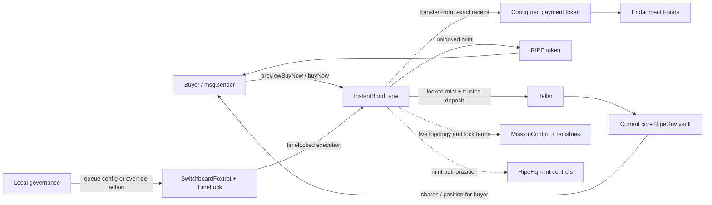

# Instant Bond Lane

This is the **start-here guide** for the Instant Bond Lane feature. It explains what
the mechanism does, how a purchase moves through the protocol, how the epoch
controller changes the next rate, how governance intervenes, and which production
decisions are still deliberately blocked.

> **Current status — contract candidate, not an active product.** The Instant Bond
> branch contains feature checkpoint `5d12e60070d6892ce481813b27784bbe2dcfd43b`
> and integrates `rh-audit-remediation@c9ae47e1854e676b5846c98baa40f5d0fdfaf324` through merge
> checkpoint `428fa5ed15b396717f833f96cb961f5fb460c88e` on branch
> `instant-bond-lane`, proposed by draft PR
> [#156](https://github.com/Ripe-Foundation/ripe-protocol/pull/156) against `rh`.
> The contracts, tests, generated ABIs, and deterministic controller model are
> implemented and validated. They are **not deployed, configured, economically
> calibrated, or authorized for activation**. The activation manifest remains
> fail-closed.

This README is an onboarding map, not the normative specification. If it ever
conflicts with [`implementation-spec.md`](implementation-spec.md), the implementation
specification and contract source control.

## Fast reading path

For a quick ramp-up, read in this order:

1. This README for the system and transaction model.
2. [`contracts/core/InstantBondLane.vy`](../../contracts/core/InstantBondLane.vy) for
   purchase, preview, pricing, settlement, and stored state.
3. [`contracts/config/SwitchboardFoxtrot.vy`](../../contracts/config/SwitchboardFoxtrot.vy)
   for timelocked governance.
4. [`pricing-design.md`](pricing-design.md) for the economic rationale and risks.
5. [`dynamic-controller-proposal.md`](dynamic-controller-proposal.md) for exact
   controller and override derivation.
6. [`implementation-spec.md`](implementation-spec.md) for the normative ABI,
   invariants, threat model, tests, and historical evidence.
7. [`../../config/instant-bond-lane-activation.json`](../../config/instant-bond-lane-activation.json)
   for the machine-checked list of inputs still required before activation.

## What the mechanism is

The Instant Bond Lane is a dedicated, permissionless **Buy Now lane for newly minted
RIPE**:

- a buyer pays an immutable, deployment-selected, dollar-denominated ERC-20;
- payment goes directly to Endaoment Funds;
- the Lane mints RIPE for that purchase;
- the buyer receives RIPE unlocked, or asks the Lane to deposit it into the current
  core RipeGov vault with a lock; and
- the next epoch's base payout rate responds to how much of the prior epoch sold and
  when that payment volume arrived.

It is not BondRoom, a Dutch auction, an order book, or a fair-value oracle. It is a
bounded **cap-clearing demand controller**. Its question is: “At this rate, how much
of the governed epoch capacity cleared?” It does not independently know what RIPE is
worth on external markets.

Every successful purchase mints new RIPE. The main economic safety boundaries are the
per-epoch payment cap, all-in rate ceiling, cumulative mint budget, pause/mint
controls, exact payment settlement, and conservative production calibration.

## System map



The Lane and Foxtrot are nonupgradeable Vyper contracts. Foxtrot has an immutable Lane
target. The Lane intentionally follows the protocol's broader Department trust model:
any registered switchboard is authorized at the on-chain boundary, while Foxtrot is
the intended semantic route. Deployment qualification must prove no other registered
switchboard exposes an unintended generic call path to the Lane mutators.

## A purchase from start to finish

### 1. Preview from the buyer address

The buyer calls:

```text
previewBuyNow(paymentAmount, requestedLock)
```

The returned `InstantBondQuote` includes:

- whether the same caller appears ready to execute now;
- projected epoch and both pricing/live config versions;
- base rate, remaining epoch capacity, minimum payment, and remaining mint budget;
- base RIPE, bonus, actual lock, and total RIPE;
- the current core RipeGov vault ID for a locked purchase; and
- live early-exit, exit-fee, and bad-debt-freeze disclosure.

`available` is caller-specific. It checks deterministic same-state prerequisites that
the Lane can reasonably inspect: payment size, balance, allowance, pause and mint
controls, RIPE blacklist, Endaoment destination, mint budget, current core-vault
identity, supported asset/deposit gates, vault validity and pause state, and migrated
position status.

It is still a quote, not a reservation. Another transaction can consume capacity,
change a live control, rotate a vault, update lock terms, or advance the epoch before
the purchase lands.

### 2. Bind the transaction

The complete purchase call is:

```text
buyNow(
    paymentAmount,
    requestedLock,
    expectedEpoch,
    minRipeOut,
    deadlineBlock,
    expectedCoreRipeGovVaultId=0,
    minActualLock=0,
)
```

The caller should normally bind:

- `expectedEpoch` to the previewed epoch;
- `minRipeOut` to an acceptable payout floor;
- `deadlineBlock` to a short validity window;
- `expectedCoreRipeGovVaultId` to the previewed nonzero vault ID for a locked buy; and
- `minActualLock` to the shortest acceptable realized lock.

Zero for the last two fields opts out of those optional constraints. A nonzero
`requestedLock` is never silently downgraded to an unlocked purchase: if the live lock
terms cannot produce a nonzero lock, execution reverts. Callers that want unlocked
RIPE must request zero.

Purchases are full-fill-only. The Lane never silently reduces `paymentAmount`; if
another buyer consumes capacity first, the transaction reverts and the client must
preview again and retry.

### 3. Update state and settle atomically

The Lane projects initialization or rollover, records the new accounting, and then:

1. transfers the exact payment amount directly to Endaoment Funds;
2. verifies the destination balance increased by exactly that amount;
3. mints the quoted RIPE; and
4. either sends it to the buyer or deposits it through Teller into the current core
   RipeGov vault for the buyer.

For locked settlement, the Lane dynamically resolves `coreRipeGovVaultId()` at
execution time, verifies the Teller-reported deposited amount, restores its preexisting
RIPE balance, and clears the Teller allowance. Any downstream failure reverts the
entire transaction, including projected rollover, accepted-payment accounting,
weighted timing, mint-budget use, and one-shot override consumption.

The production activation policy supports a specifically qualified, non-callback
payment token. Exact-receipt checks reject fee-on-transfer, short, zero, excess, and
false-return settlement behavior. Callback behavior is tested for atomicity but is not
qualified for production by default.

## Epochs and fixed pricing

The Lane has its own immutable block clock:

```text
epoch = (block.number - GENESIS_BLOCK) // EPOCH_LENGTH
```

There is no keeper-only initialization or rollover transaction:

- before the first successful purchase, `previewBuyNow` projects `seedRate` and a
  successful `buyNow` initializes the Lane;
- all successful purchases in one stored epoch use the same snapshotted base rate,
  payment cap, minimum payment, and maximum lock bonus;
- `previewBuyNow` projects a later epoch without writing state; and
- the first successful purchase in that later epoch commits the rollover.

Epoch state is therefore **lazy**. Public getters such as `epochRate` describe the last
successfully committed epoch. Consumers must use `previewBuyNow`, not reconstruct a
current quote from stored getters.

Epochs before first initialization do not create historical decay. A first
initialization is timing-eligible only at deterministic offset zero; a partial cold-
start epoch uses the weakest upward step if its utilization is high. Every later
stored epoch is timing-eligible.

## How the controller moves the next rate

The Lane stores an inverse payout rate:

```text
rate = RIPE-wei paid per one whole payment token
baseRipe = paymentAmount * rate // PAYMENT_SCALE
```

This direction is easy to misread:

- **higher rate** → the buyer receives more RIPE → RIPE's implied price is lower;
- **lower rate** → the buyer receives less RIPE → RIPE's implied price is higher.

For the prior stored epoch:

```text
utilizationBps = acceptedPayment * 10_000 // paymentCap
```

The next successful rollover applies one of four behaviors:

| Prior result | Signal | Next-rate behavior |
|---|---|---|
| High utilization | `utilization >= uHighBps` | Lower the payout rate, raising implied RIPE price by `minUpBps..maxUpBps`. |
| Dead band | `uLowBps < utilization < uHighBps` | Apply no utilization step; a newly lowered ceiling may still clamp the rate. |
| Low positive utilization | `utilization <= uLowBps` | Raise the payout rate, lowering implied RIPE price by `minDownBps..maxDownBps`. |
| Skipped empty time | No committed purchases in intervening epochs | Apply fixed `decayBps`, capped by `maxDecayEpochs`. |

### High utilization: amount-weighted timing

The high branch uses both utilization strength and amount-weighted purchase timing.
For each purchase, the Lane computes its normalized block lateness and accumulates:

```text
epochWeightedLateness += paymentAmount * latenessBps
averageLateness = epochWeightedLateness // acceptedPayment
earliness = 10_000 - averageLateness
```

Weighting makes same-block split, merge, and order permutations equivalent. A small
late tail cannot erase a large early purchase, and a small early probe cannot make
large late demand appear early.

Exactly `uHighBps` receives `minUpBps` regardless of timing. At full utilization, a
first-block eligible epoch can reach `maxUpBps`, while a final-block fill receives
`minUpBps`. Intermediate demand interpolates between them.

Timing is nevertheless strategically selectable because the epoch price is fixed. A
buyer can wait for the final block without paying a worse same-epoch rate. Production
activation therefore requires `minUpBps` and the entire range to remain safe under
repeated final-block full-cap purchases; the current simulator values are not approved
calibration.

### Low utilization and skipped epochs

The low branch ignores timing and scales the downward adjustment by how far utilization
falls below `uLowBps`. A positive-payment epoch exactly at the low threshold receives
`minDownBps`; near-zero utilization can reach `maxDownBps`.

After applying the prior positive epoch's utilization transition once, a multi-epoch
gap applies:

```text
min(elapsedEpochs - 1, maxDecayEpochs)
```

fixed decay steps. Pause, disablement, budget exhaustion, or lack of buyers does not
stop the deterministic clock or create a separate rebaseline. The controller's bounds
ensure the weakest upward response is not undone by a stronger positive-payment or
empty-epoch downward response away from explicit floor/ceiling saturation.

For exact staged integer formulas and rounding direction, use
[`dynamic-controller-proposal.md`](dynamic-controller-proposal.md), not a reimplementation
from this summary.

## Snapshot fields versus live fields

A full config write replaces all 15 fields and increments `configVersion`, but it does
not rewrite the already committed epoch snapshot.

| Snapshotted until initialization/rollover | Read live for each preview/purchase |
|---|---|
| Base payout rate | `canBuyNow` |
| Epoch payment cap | Remaining cumulative `mintBudget` |
| Epoch minimum payment | Department, RIPE, and global mint availability |
| Epoch maximum lock bonus | RIPE blacklist |
| Pricing config version | MissionControl lock terms and core vault ID |
| | Address-registry destinations and Teller/vault admission |

Changing a pricing field mid-epoch is prospective. Even lowering
`maxEffectiveRate` does not rewrite the running epoch's rate; the new ceiling is applied
at rollover. Emergency operators must pause or disable purchases when immediate effect
is required. A full config change also invalidates any installed rate override.

## Locking and bonus behavior

An unlocked purchase uses `requestedLock=0` and mints RIPE directly to the buyer.

For a locked purchase:

- live MissionControl terms define minimum and maximum duration;
- `actualLock = min(requestedLock, maxLock)` once the request meets the minimum;
- the epoch's `maxLockBonus` bounds a linear duration bonus;
- the all-in `maxEffectiveRate` ceiling reserves room for the maximum possible bonus;
  and
- Teller deposits the complete RIPE amount into the current core RipeGov vault for
  `msg.sender`.

RipeGov blends new deposits into an account-level weighted position. A dominant active
or expired position can dilute the effective new commitment. For that reason, the
approved production activation policy requires `maxLockBonus=0` until isolated lock
lots exist. Nonzero-bonus code and model cases remain tested dormant arithmetic, not an
approved launch configuration.

Live exit permission, exit fee, and bad-debt freeze status are disclosed by preview but
are not transaction-bound. The current buyer-bindable settlement terms are expected
core vault ID and minimum actual lock.

## Governance and the manual rate override

`SwitchboardFoxtrot` combines the repository's LocalGov and TimeLock patterns and
queues three tagged action types:

1. replace the complete Instant Bond config;
2. install one exact rate override; or
3. cancel an override already installed in the Lane.

Proposal-time validation requires governance authority, a nonzero action timelock,
and current optimistic versions. Execution revalidates inside the Lane. If an
intervening action makes the target stale, execution reverts atomically and the queued
action remains available for explicit cancellation until TimeLock expiry.

The override is a one-shot exact **rate** target, not an implied-price value. It can be
installed only after initialization, only when no override is installed, and only
within `MIN_BASE_RATE..currentBaseRateCeiling`.

Its lifecycle is intentionally narrow:

- same-epoch purchases leave it pending;
- preview projects it without consuming it;
- the first later successful rollover stores it exactly and consumes it once;
- no skipped-epoch decay is applied to the target before use;
- a failed downstream purchase restores it through transaction rollback;
- a successful full config write invalidates it; and
- the following epoch resumes normal control from the overridden stored rate.

There is no target epoch, expiry, or maximum lead. Operators must revalidate or cancel
an installed override before reopening after a long pause or disablement. The ordinary
counterfactual `controllerRate` is emitted when an override applies.

## Configuration at a glance

The ABI-locked config struct is duplicated byte-for-byte in both contracts:

| Field group | Fields | Purpose |
|---|---|---|
| Availability | `canBuyNow` | Live purchase switch. |
| Capacity | `paymentCapPerEpoch`, `minPaymentAmount` | Snapshotted epoch capacity and minimum full-fill size. |
| Supply | `mintBudget` | Instance-local cumulative RIPE issuance ceiling. |
| Rates | `maxEffectiveRate`, `seedRate` | All-in payout ceiling and cold-start base rate. |
| Utilization | `uHighBps`, `uLowBps` | High, dead-band, and low branch thresholds. |
| Price up | `minUpBps`, `maxUpBps` | High-demand implied-price increase range. |
| Price down | `minDownBps`, `maxDownBps` | Low-demand implied-price decrease range. |
| Empty time | `decayBps`, `maxDecayEpochs` | Fixed skipped-epoch response and loop cap. |
| Locking | `maxLockBonus` | Snapshotted maximum lock bonus; production policy is zero. |

`mintBudget` is local to one Lane deployment. A replacement or concurrent Lane would
start with separate `cumulativeMinted` state, so activation requires an external
aggregate issuance ledger and may allocate only the approved remaining program budget.

No values in the simulator fixture are production recommendations.

## Main APIs and events

### InstantBondLane

User entry points:

```text
previewBuyNow(paymentAmount, requestedLock) -> InstantBondQuote
buyNow(paymentAmount, requestedLock, expectedEpoch, minRipeOut, deadlineBlock,
       expectedCoreRipeGovVaultId=0, minActualLock=0) -> totalRipe
```

Governance validation and mutation:

```text
isValidConfig(config)
setConfig(config, expectedVersion)
isValidRateOverride(targetRate, expectedConfigVersion, expectedOverrideVersion)
setRateOverride(targetRate, expectedConfigVersion, expectedOverrideVersion)
canCancelRateOverride(expectedOverrideVersion)
cancelRateOverride(expectedOverrideVersion)
```

Important state:

```text
config / configVersion
isInitialized / currentEpoch / epochRate
epochPaymentCap / epochMinPaymentAmount / epochMaxLockBonus
epochPricingVersion / epochAcceptedPayment
epochWeightedLateness / epochTimingEligible
rateOverride / overrideVersion
cumulativeMinted
```

Events:

```text
EpochInitialized
EpochRolled
InstantBondPurchased
InstantBondConfigSet
RateOverrideInstalled
RateOverrideApplied
RateOverrideCancelled
RateOverrideInvalidated
```

### SwitchboardFoxtrot

```text
setInstantBondConfig(config, expectedVersion)
setInstantBondRateOverride(targetRate, expectedConfigVersion, expectedOverrideVersion)
cancelInstantBondRateOverride(expectedOverrideVersion)
executePendingAction(actionId)
cancelPendingAction(actionId)
```

Use the generated ABIs for exact tuple layout, overloads, output names, event field
order, and indexing:

- [`../../scripts/abis/InstantBondLane.json`](../../scripts/abis/InstantBondLane.json)
- [`../../scripts/abis/SwitchboardFoxtrot.json`](../../scripts/abis/SwitchboardFoxtrot.json)

## Security properties to preserve

Anyone changing this feature should treat these as hard boundaries:

- exact payment receipt at Endaoment Funds;
- exact RIPE mint/Teller settlement and restoration of the Lane's preexisting RIPE
  balance;
- dynamic `coreRipeGovVaultId()` resolution and buyer-bindable vault identity;
- caller-specific blacklist and deterministic preview readiness;
- no silent lock downgrade;
- fixed same-epoch snapshot and correct accepted-payment/weighted-lateness
  accumulation;
- preview purity and full transaction rollback after every downstream failure;
- optimistic config/override versions and one-shot override consumption;
- weakest-up versus downward/empty anti-ratchet bounds;
- byte-identical Lane/Foxtrot config structs and ABI field order;
- Foxtrot's nonzero action-timelock proposal guard; and
- the registered-switchboard authority model plus deployment-time route inventory.

Contract size is a practical constraint. Post-remediation-integration deployed runtime
is 12,905 bytes for Lane against a 13,000-byte project ceiling and 6,163 bytes for
Foxtrot against 6,500 bytes. The Foxtrot increase comes from the newly integrated
shared governance modules; the complete feature gate remains green. Recompile and
remeasure after every production-source or imported-module change, and do not weaken a
safety check merely to recover bytes.

## What is deliberately not implemented

The current design excludes:

- an external fair-value, solvency, or payment-token depeg oracle;
- automatic DEX-based price changes;
- within-epoch price ramps or tranches;
- partial fills or capacity reservations;
- delegated recipients;
- automatic override expiry or target-epoch scheduling;
- per-epoch historical mappings; and
- an automatic pause-clock or rebaseline after unavailable time.

These are explicit scope decisions, not accidental omissions.

## Activation is still blocked

The branch is implementation-ready for review, not deployment-ready. Run:

```bash
python scripts/qualify_instant_bond_lane_activation.py \
  --manifest config/instant-bond-lane-activation.json \
  --check-draft

python scripts/qualify_instant_bond_lane_activation.py \
  --manifest config/instant-bond-lane-activation.json \
  --require-ready
```

The first command must confirm that the blocked draft is structurally valid. The
second command is expected to fail until every production input is supplied and
approved. Missing categories currently include:

- economic calibration and safe final-block sellout constraints;
- aggregate issuance accounting and replacement-Lane budget reconciliation;
- payment-token identity, code hash, depeg monitoring, pause, and reopening policy;
- full-fill retry and override-reopening runbooks;
- constructor parameters, realistic epoch/genesis bounds, deployed code hashes, and
  post-deployment immutable assertions;
- registered-switchboard selector/code-hash inventory;
- credentialed archive-fork topology and locked/unlocked purchase qualification; and
- indexer owner and event-schema approval.

`activation_approved` must remain false until a separately authorized activation
phase closes all of those gates. Passing contract tests does not satisfy them.

## Validation commands

Generated and machine-checked surfaces:

```bash
python scripts/export_abis.py --check
python scripts/simulations/instant_bond_lane_controller.py \
  --check docs/instant-bond-lane/controller-simulation-v2.json
python scripts/qualify_instant_bond_lane_activation.py --check-draft
python -m pip check
git diff --check
```

Complete feature selection, including artifact, fuzz, gas, runtime, workflow, and
activation tests:

```bash
python -m pytest \
  -q \
  -p no:cacheprovider \
  -o addopts='' \
  tests/core/instantBondLane \
  tests/config/test_switchboard_foxtrot.py \
  tests/deployment/test_instant_bond_lane_activation.py \
  tests/deployment/test_abi_export.py \
  tests/test_instant_bond_lane_workflow.py
```

The repository workflow additionally runs branch-aware coverage and enforces separate
85% thresholds for Lane and Foxtrot. Keep Boa, Hypothesis, Python, pytest, XDG, and
coverage caches outside the worktree when reproducing final evidence.

Current production-source evidence is recorded in
[`implementation-spec.md` §20.7](implementation-spec.md#207-revision-23-pr-156-remediation-authority-and-evidence).
That section records the original revision-23 remediation checkpoint. The later
17 August 2026 integration of `rh-audit-remediation@c9ae47e` was independently rerun
against the merged tree: 211 tests passed, two credential-gated fork tests skipped,
Lane coverage was 85.03%, Foxtrot coverage was 93.98%, all 57 ABI outputs and the
source-bound controller artifact were current, and the activation draft remained
valid and blocked.

## Agent change checklist

Before modifying this feature:

1. Rebind the live branch, PR head, RH base, Vyper `0.4.3`, and clean worktree.
2. Read this README, then the exact normative sections affected by the change.
3. Preserve the config field order in both contracts.
4. Add a regression or independent-model case before changing mechanism behavior.
5. Recompile and measure both deployed runtimes after every meaningful contract edit.
6. Regenerate the Lane/Foxtrot ABIs after any ABI or event change.
7. Regenerate the controller JSON after either production source file changes; its
   artifact binds exact source hashes.
8. Run the complete feature gate with normally excluded markers enabled.
9. Keep economic calibration, deployment, configuration, minting, and activation as
   separate owner-authorized phases.
10. Never call the feature production-ready while `--require-ready` fails.

## Frequently asked questions

### Is an “instant bond” a normal bond or a claim on existing RIPE?

No. It is a direct primary-market RIPE purchase with optional RipeGov locking. The
Lane mints new RIPE within governed capacity and budget limits.

### Does an early sellout affect the next epoch more than a late sellout?

Yes. On a high-utilization, timing-eligible epoch, payment-weighted earliness can move
the adjustment from `minUpBps` toward `maxUpBps`. A final-block full-cap purchase still
receives the minimum upward response, which is why production calibration must make
that minimum safe on its own.

### Can governance manually set the next rate?

Yes, through a timelocked, versioned, one-shot exact rate override. It applies only at
the next successful rollover, preview does not consume it, and a full config change
invalidates it.

### Can governance change the current epoch's price immediately?

No. Pricing fields are prospective and the committed epoch snapshot stays fixed.
Pause or `canBuyNow=false` is the immediate emergency control.

### Does the Lane use a market oracle?

No. It responds only to its own realized demand and elapsed epochs. External depeg and
fair-value risks are managed through conservative bounds and the still-unfilled
operational activation gates.

### Is the feature ready to deploy because the tests pass?

No. The code candidate and activation qualification are intentionally separate. The
manifest's failing `--require-ready` result is the authoritative deployment/activation
blocker.
